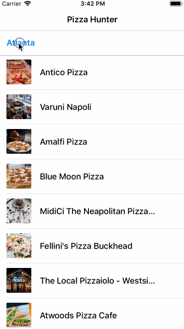
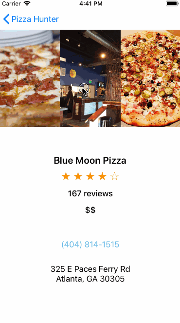

# pizzahunter

 _PizzaHunter_  is a mini Swift app that allows users to search for Pizza Restauraunts near them. It also displays the Restaurant details from list of Restauraunts presented in the TableView.  

# Note

I re-build the demo app of Ray Wenderlich's blog: [How to make a Restful app with Siesta](https://www.raywenderlich.com/5429-how-to-make-a-restful-app-with-siesta) . I followed the tutorial with the intention of introducing myself to the new concepts. Along the way, I gained strong understanding of :

  - How to Incorporate API's in the app.  [Yelp API](https://www.yelp.com/developers/documentation/v3) used here
  - How to harness the power of Frameworks. [Siesta Framework](https://github.com/bustoutsolutions/siesta) used here
  - UITableView
  
  
  
  # Screenshot
  
  &nbsp;&nbsp;&nbsp; 
  

